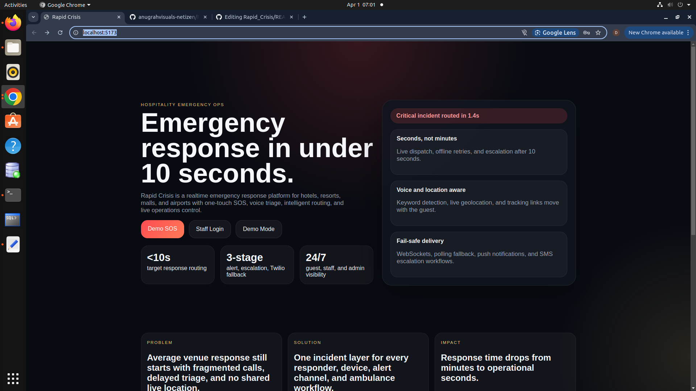
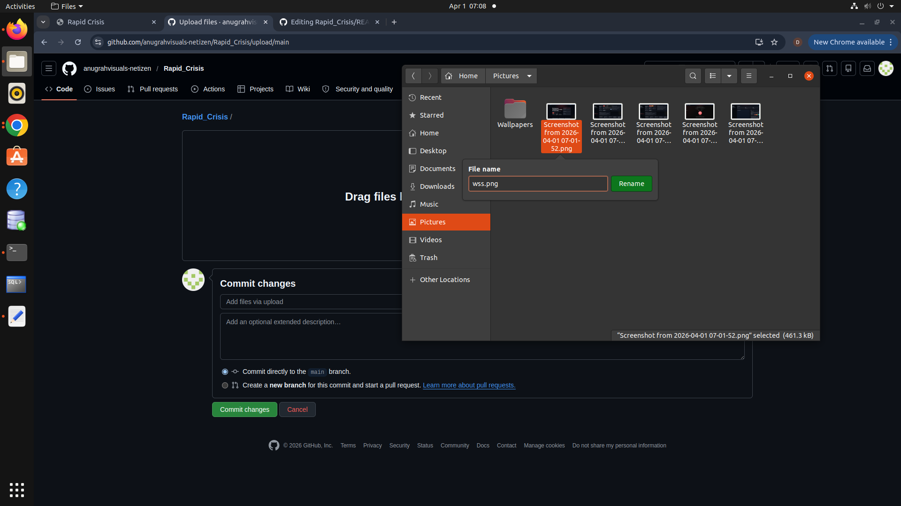
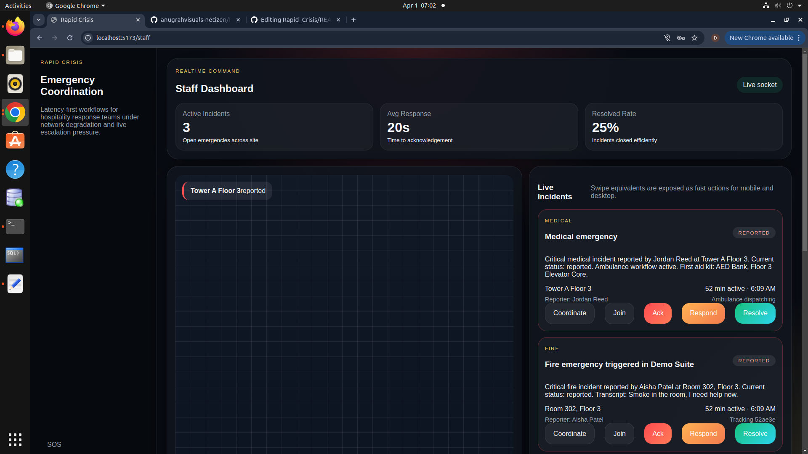
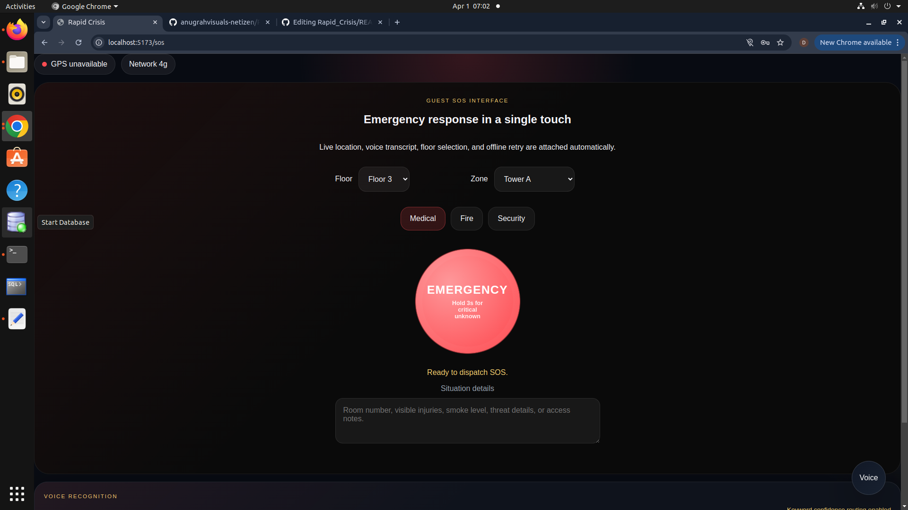
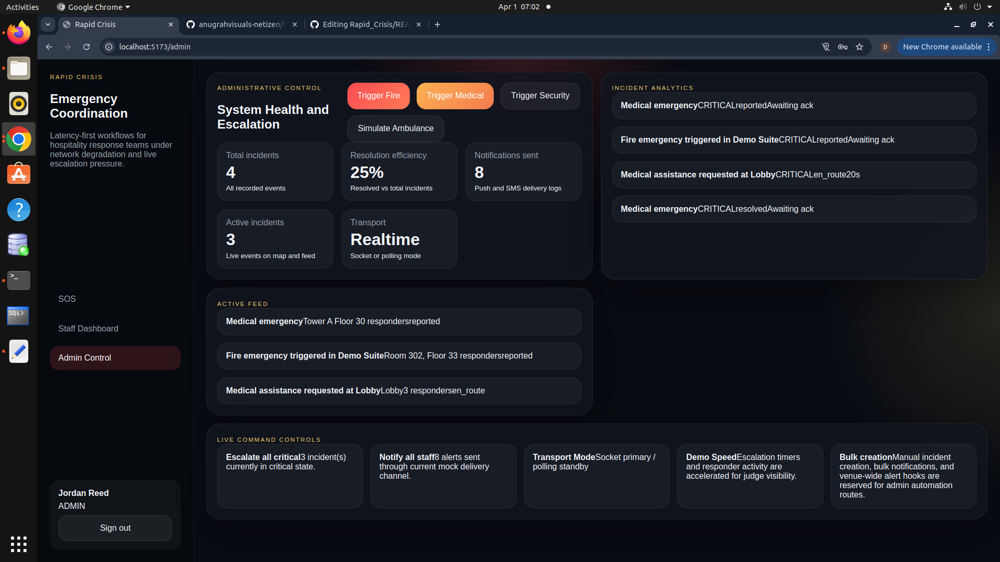
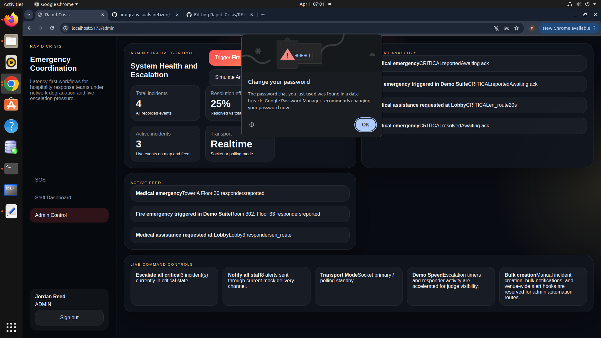

Project Name
Rapid Crisis

Problem Statement
In hospitality environments — hotels, resorts, malls, and airports — emergencies are mishandled not because help is unavailable, but because communication breaks down. Staff are unreachable, locations are unclear, and response is uncoordinated. Every second of delay in a medical or fire emergency directly increases risk to life. Existing systems are slow, fragmented, and not built for high-pressure, real-time coordination.

Project Description
Rapid Crisis is a real-time emergency response and crisis coordination platform built for hospitality environments. Guests trigger an SOS in one tap or via voice command — the system instantly classifies the incident, shares live GPS location, notifies the right responders by role and proximity, dispatches first aid alerts, and initiates ambulance calls automatically. Staff coordinate through a live dashboard with real-time incident chat, status tracking, and escalation timers. If no one responds within 10 seconds, the system auto-escalates to higher authority. It works offline, queuing alerts until connectivity is restored. The result: a full emergency response cycle — from panic button to coordinated action — in under 10 seconds.

Google AI Usage
Tools / Models Used

Gemini API (gemini-1.5-pro)

How Google AI Was Used
Gemini is integrated as the AI incident summarisation engine. When an SOS is triggered, raw alert data — incident type, voice transcript, GPS location, floor, and priority level — is sent to the Gemini API. It returns a concise, plain-language summary optimised for first responders, who need to act immediately without reading raw data fields.

Type: Medical, Location: Room 712 Floor 7, Voice: "chest pain not breathing", Priority: Critical
Cardiac emergency in Room 712, Floor 7. Guest reports chest pain and difficulty breathing. AED located at the Floor 7 elevator bank.
Gemini also assists in voice keyword classification — helping map ambiguous spoken phrases to the correct incident type when the primary Speech API confidence score falls below threshold.

Installation Steps
# Clone the repository
git clone <your-repo-link>

# Go to project folder
cd rapid-crisis

## Screenshots 
  

# Install dependencies (root, client, and server)
npm install
cd client && npm install && cd ..
cd server && npm install && cd ..

# Configure environment
cp .env.example .env
# Add your Firebase, Google Maps, and Gemini API keys

# Run the project
npm start
